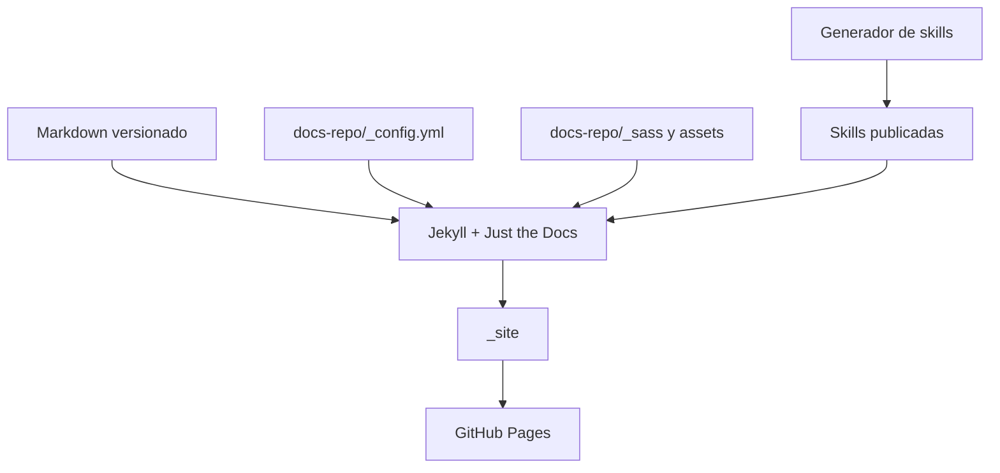
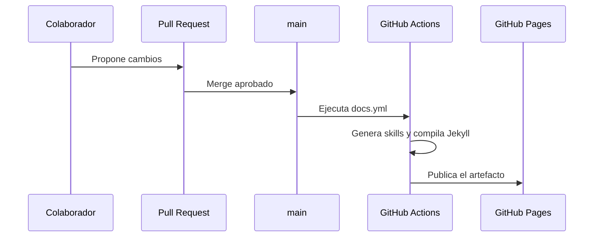

# Arquitectura del Portal

Este repositorio implementa un portal personal de documentación como sitio estático generado con **Jekyll** y **Just the Docs**.

El contenido, la configuración y los scripts de publicación viven dentro de `docs-repo/`. `README.md` y `AGENTS.md` permanecen en la raíz porque también funcionan como entradas operativas del repositorio.

## Componentes

| Componente | Responsabilidad |
| :--- | :--- |
| `README.md` | Entrada del repositorio en GitHub. |
| `AGENTS.md` | Instrucciones operativas para agentes. |
| `docs-repo/index.md` | Página principal publicada. |
| `docs-repo/_config.yml` | Configuración de Jekyll, tema, logo y búsqueda. |
| `docs-repo/_sass/` | Personalización visual del portal. |
| `docs-repo/assets/` | Recursos estáticos. |
| `docs-repo/docs/` | Documentación técnica. |
| `docs-repo/req/` | Guías y plantillas de requerimientos. |
| `docs-repo/procesos/` | Procesos reutilizables. |
| `.agents/skills/` | Skills locales versionadas. |
| `docs-repo/scripts/generate-skills-docs.ts` | Genera el catálogo temporal de skills. |
| `.github/workflows/docs.yml` | Build y despliegue a GitHub Pages. |

## Flujo de publicación

## Decisiones

- **Docs-as-Code:** el contenido se versiona y revisa junto con el repositorio.
- **`docs-repo/`:** concentra publicación, contenido técnico, validación y estilo.
- **Docker:** evita depender de una instalación local de Ruby.
- **GitHub Pages:** publica el sitio estático desde `main`.
- **Skills generadas:** `.agents/skills/**/SKILL.md` es la fuente de verdad; `docs-repo/docs/inteligencia-artificial/skills.md` se genera durante el build.
