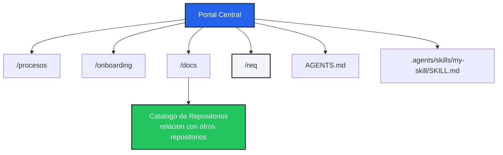
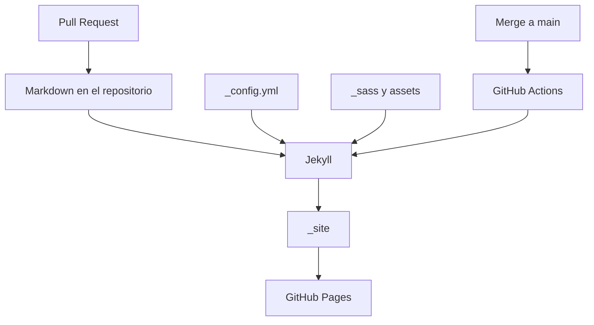
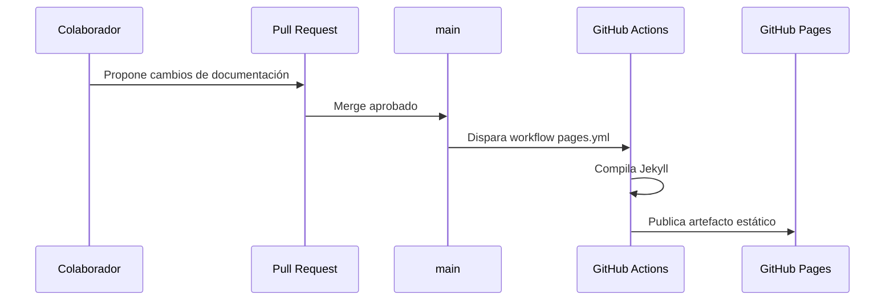

# 🧱 Arquitectura del Portal

Este repositorio implementa el portal central de documentación de l4 repo docs como un sitio estático generado con **Jekyll** y el tema **Just the Docs**.

El objetivo técnico es mantener documentación versionada, revisable por Pull Request y publicada automáticamente en GitHub Pages.

---

## Arquitectura centralizada y distribuida

Para garantizar que la documentación técnica no se quede obsoleta y evolucione a la par del código fuente, en **l4 repo docs** adoptamos un modelo de documentación **centralizado y distribuido**:

*   **Centralizado:** el portal l4 repo docs concentra estándares, procesos, onboarding, catálogo, referencias organizacionales y lineamientos transversales.
*   **Distribuido:** cada repositorio mantiene la documentación que depende directamente de su código, arquitectura, despliegue, variables, casos de uso y operación.

Esta separación permite que el portal mantenga una visión común de la organización, mientras cada repositorio conserva la documentación que debe cambiar junto con su implementación.

1. **Portal central:** aloja políticas de ingeniería, procesos globales, onboarding, catálogo de sistemas y requerimientos de negocio transversales.
2. **README de cada repositorio:** sirve como entrada inicial del proyecto y enlaza a su documentación relevante.
3. **Documentación técnica en `/docs`:** vive en cada repositorio y se publica en su propia GitHub Page.
4. **Catálogo de Repositorios:** en cada repositorio documenta sus repositorios relacionados o dependencias. En el portal central registra todos los repositorios l4 repo docs y enlaza a su documentación publicada, no a archivos Markdown crudos.
5. **Requerimientos en `/req`:** documentan casos de uso, historias, criterios de aceptación y reglas cuando aplican.
6. **Procesos en `/procesos`:** describen cómo colaboran Producto y TI para desarrollar, revisar, integrar y entregar cambios.
7. **AGENTS.md y Agent Skills:** el portal central también es un repositorio l4 repo docs, por eso puede tener instrucciones para agentes y skills reutilizables igual que cualquier otro repositorio.

---

## Componentes principales

| Componente | Responsabilidad |
| :--- | :--- |
| `README.md` | Entrada técnica para colaboradores del repositorio. |
| `AGENTS.md` | Instrucciones operativas para agentes de código que trabajen en el repositorio. |
| `index.md` | Página principal del portal publicado. |
| `_config.yml` | Configuración de Jekyll, tema, navegación, logo y búsqueda. |
| `_sass/` | Personalización visual del tema con tokens l4 repo docs. |
| `assets/` | Recursos estáticos como logos e imágenes. |
| `docs/` | Documentación técnica del propio portal. |
| `docs/inteligencia-artificial/index.md` | Referencia organizacional para el uso de estándares abiertos de inteligencia artificial, incluyendo `AGENTS.md` y Agent Skills. |
| `docs/repositorios.md` | Repositorios relacionados del repo actual; en el portal central, inventario de todos los repositorios l4 repo docs. |
| `.agents/skills/` | Ubicación recomendada para Agent Skills versionados cuando un repositorio necesite capacidades reutilizables. |
| `req/` | Guías y plantillas para requerimientos de negocio. |
| `procesos/` | Procesos transversales, como GitHub Flow l4 repo docs. |
| `.github/workflows/pages.yml` | Pipeline de compilación y despliegue a GitHub Pages. |

---

## Flujo de publicación

1. Un colaborador modifica Markdown, configuración, estilos o assets en una rama.
2. El cambio se revisa mediante Pull Request.
3. Al fusionar en `main`, GitHub Actions ejecuta el build de Jekyll.
4. El sitio generado se publica en GitHub Pages.

---

## Decisiones técnicas

*   **Jekyll + Just the Docs:** Permite publicar documentación Markdown con navegación, búsqueda y jerarquía de páginas sin construir una aplicación custom.
*   **GitHub Pages:** Reduce la operación del portal; el hosting y despliegue viven dentro de GitHub.
*   **Docs-as-Code:** La documentación se revisa, versiona y despliega con el mismo flujo que el código.
*   **Estándares abiertos para IA:** La documentación de inteligencia artificial referencia estándares externos como `AGENTS.md` y Agent Skills para mantener compatibilidad con herramientas del ecosistema.
*   **Docker para validación local:** Evita depender de la versión de Ruby instalada en cada máquina.
*   **Assets versionados:** El logo y estilos de l4 repo docs viven en el repositorio para que el build sea reproducible.

---

## Límites del sistema

Este portal no reemplaza la documentación específica de cada producto. Cada repositorio l4 repo docs debe mantener su propia documentación técnica en `/docs` cuando el detalle dependa del código, despliegue o arquitectura de ese sistema.

El portal central define estándares, procesos y puntos de entrada compartidos.
