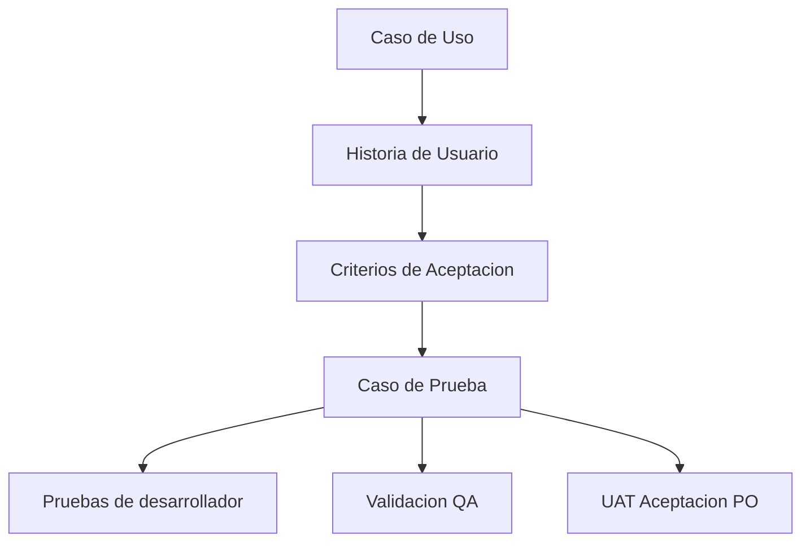

# 🧪 Guía: ¿Cómo redactar un Caso de Prueba?

Un **Caso de Prueba** describe una validación concreta que permite comprobar si una funcionalidad cumple el comportamiento esperado.

En l4 repo docs, los casos de prueba conectan la intención de negocio con la validación técnica y funcional del sistema. No reemplazan el **Caso de Uso**, la **Historia de Usuario** ni los **Criterios de Aceptación**; los aterrizan en verificaciones ejecutables.

---

## 🔗 Relación con CU, HU y criterios de aceptación



| Artefacto | Responsabilidad |
| :--- | :--- |
| **Caso de Uso** | Describe el flujo de negocio completo, actores, precondiciones, flujo principal, alternos y reglas. |
| **Historia de Usuario** | Define una porción implementable de valor para el usuario o negocio. |
| **Criterios de Aceptación** | Definen condiciones verificables para aceptar la HU. |
| **Caso de Prueba** | Convierte criterios y escenarios en validaciones ejecutables o revisables. |
| **QA** | Verifica calidad, regresión y comportamiento funcional. |
| **UAT / PO** | Confirma que la solución satisface la necesidad de negocio. |

---

## 📝 Estructura mínima

Todo caso de prueba debe contener:

| Campo | Descripción |
| :--- | :--- |
| **ID** | Identificador único. Ejemplo: `CP-001`. |
| **Título** | Nombre claro de lo que se valida. |
| **Tipo** | `Positivo`, `Negativo`, `Regresión`, `Integración`, `UAT` u otro tipo definido por el equipo. |
| **Caso de Uso relacionado** | Referencia al CU cuando aplique. |
| **Historia de Usuario relacionada** | Referencia a la HU que origina la validación. |
| **Criterio de Aceptación relacionado** | Criterio específico que se valida. |
| **Precondiciones** | Estado previo requerido para ejecutar la prueba. |
| **Datos de prueba** | Datos necesarios para ejecutar el escenario. No deben incluir secretos reales. |
| **Pasos** | Acciones ordenadas para ejecutar la prueba. |
| **Resultado esperado** | Comportamiento observable que confirma que la prueba pasa. |
| **Ambiente** | Local, preview, QA, staging, UAT u otro ambiente donde se ejecuta. |
| **Resultado** | `Pendiente`, `Aprobado`, `Fallido` o `Bloqueado`, cuando se use como evidencia de ejecución. |

---

## ✅ Tipos mínimos de casos de prueba

Para una HU funcional, considera al menos:

*   **Caso positivo:** valida el flujo esperado exitoso.
*   **Caso negativo:** valida errores, restricciones, permisos, datos inválidos o reglas no permitidas.
*   **Regresión:** valida que una funcionalidad existente no se rompió.
*   **UAT:** valida que el PO o negocio acepta el resultado contra la necesidad original.

No todas las HU requieren todos los tipos, pero el PR debe dejar claro cuáles aplican y cuáles son `N/A`.

---

## ✍️ Formato recomendado

```markdown
# CP-XXX - [Título del caso de prueba]

**Tipo:** [Positivo / Negativo / Regresión / Integración / UAT]  
**Caso de Uso relacionado:** [CU-XXX - Nombre]  
**Historia de Usuario relacionada:** [HU-XXX - Nombre]  
**Criterio de Aceptación relacionado:** [CA-XXX o descripción breve]  
**Ambiente:** [Local / Preview / QA / Staging / UAT]  
**Estado:** [Pendiente / Aprobado / Fallido / Bloqueado]

## Precondiciones

*   [Condición previa requerida]

## Datos de prueba

| Campo | Valor |
| :--- | :--- |
| [Campo] | [Valor de prueba seguro] |

## Pasos

1. [Paso 1]
2. [Paso 2]
3. [Paso 3]

## Resultado esperado

[Resultado observable que confirma que la prueba pasa.]

## Evidencia

[Comentario, captura, enlace a ejecución, issue, PR o nota de validación cuando aplique.]
```

---

## 📌 Ejemplo

```markdown
# CP-001 - Registro exitoso con datos válidos

**Tipo:** Positivo  
**Caso de Uso relacionado:** CU-003 - Registro de comercio  
**Historia de Usuario relacionada:** HU-001 - Registrar datos básicos  
**Criterio de Aceptación relacionado:** El comercio puede avanzar cuando completa campos obligatorios válidos.  
**Ambiente:** QA  
**Estado:** Pendiente

## Precondiciones

*   El usuario solicitante tiene acceso al formulario de registro.
*   El correo de prueba no existe previamente en el sistema.

## Datos de prueba

| Campo | Valor |
| :--- | :--- |
| Nombre comercial | Comercio Demo |
| Correo | demo@example.com |
| Teléfono | 8888-8888 |

## Pasos

1. Abrir el formulario de registro.
2. Completar los campos obligatorios con datos válidos.
3. Presionar `Continuar`.

## Resultado esperado

El sistema guarda los datos básicos y permite avanzar al siguiente paso del registro.
```

---

## 🧭 Uso dentro del flujo l4 repo docs

*   Durante refinamiento, Producto y TI definen criterios de aceptación verificables.
*   Durante desarrollo, la persona desarrolladora valida los escenarios técnicos mínimos.
*   Durante QA, se ejecutan casos funcionales, negativos y de regresión cuando apliquen.
*   Durante UAT, el PO valida que la solución cumple la necesidad de negocio.
*   El Pull Request debe indicar qué pruebas aplican, cuáles fueron ejecutadas y qué queda como `N/A`.

Para el flujo completo de ramas, PRs, QA, UAT y ambientes, consulta **[GitHub Flow l4 repo docs](../procesos/github-flow.md)**.
