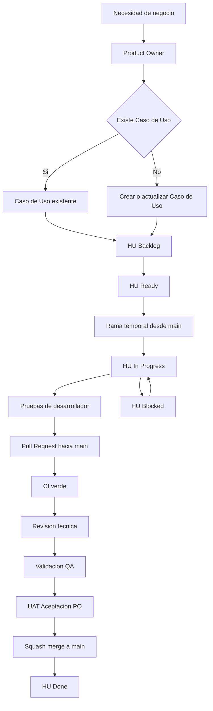

# 🔄 GitHub Flow l4 repo docs

Este documento vive en `/procesos` porque define una forma de trabajo transversal. Explica cómo una **Historia de Usuario (HU)** avanza desde una necesidad validada por negocio hasta una entrega integrada en `main`. Es el punto de unión operativo entre Producto y TI: Producto define el valor esperado y los criterios de aceptación; TI implementa, prueba, integra y documenta el cambio.

---

## 🧭 Principio base

En l4 repo docs utilizamos **GitHub Flow**:

1. Todo cambio parte desde `main`.
2. El trabajo se realiza en una rama corta.
3. La integración ocurre mediante Pull Request.
4. El Pull Request debe pasar CI, revisión técnica, validación QA y UAT cuando aplique.
5. El cierre se realiza con `Squash merge`.
6. `main` representa el estado integrado y entregable.

---

## 🔗 Relación entre necesidad, HU y entrega

Todo flujo inicia con una necesidad de negocio identificada por Producto. Esa necesidad debe mapearse a un **Caso de Uso** existente o provocar la creación/actualización de uno nuevo antes de llegar a desarrollo.



La HU define el alcance y los criterios de aceptación. El Pull Request demuestra que el cambio fue implementado, revisado, validado e integrado conforme a esos criterios.

---

## 📌 Estados de la Historia de Usuario

| Estado | Significado | Responsabilidad principal |
| :--- | :--- | :--- |
| **Backlog** | La necesidad existe, pero aún no está lista para desarrollo. Debe estar vinculada a un caso de uso existente o a la creación/actualización de uno nuevo. | Producto |
| **Ready** | La HU tiene alcance, criterios de aceptación y prioridad suficiente para iniciar. | Producto + TI |
| **In Progress** | La implementación está en desarrollo en una rama de trabajo. | Desarrollo |
| **Blocked** | Existe un impedimento que impide avanzar o validar la HU. | Responsable del bloqueo |
| **Done** | El cambio está integrado en `main`, con CI verde, revisión técnica, validación QA, UAT cuando aplique y documentación actualizada si corresponde. | Producto + TI |

Una HU no debe pasar a `Ready` si sus criterios de aceptación no son verificables. Una HU no debe pasar a `Done` si el Pull Request relacionado no fue integrado a `main` o si quedan validaciones QA/UAT pendientes cuando apliquen.

---

## 🌿 Ramas de trabajo

Toda rama debe crearse desde `main` y representar una HU o un cambio pequeño y trazable.

Formato recomendado:

```text
feature/HU-id-descripcion
```

Ejemplos:

```text
feature/HU-001-registro-comercio
feature/HU-014-validacion-correo
```

Para cambios que no nacen de una HU, usa un prefijo que describa la intención:

```text
fix/corregir-validacion-identificacion
docs/actualizar-guia-onboarding
chore/ajustar-ci
```

La rama de trabajo es temporal. Puede desplegarse o liberarse a ambientes de validación cuando el pipeline del repositorio lo soporte, pero no reemplaza la integración final hacia `main`.

---

## 💻 Desarrollo y pruebas de desarrollador

Durante `In Progress`, la persona desarrolladora debe:

*   Implementar el cambio dentro del alcance de la HU.
*   Revisar los criterios de aceptación aplicables.
*   Ejecutar las pruebas de desarrollador correspondientes al tipo de repositorio.
*   Actualizar `README.md`, `/docs` o `/req` cuando el cambio modifique comportamiento, configuración, API, despliegue, reglas de negocio o flujos de usuario.

Las pruebas de desarrollador se registran en el Pull Request como checklist. No se requiere adjuntar evidencias, capturas o logs salvo que el equipo lo solicite explícitamente para un caso puntual.

---

## 🧪 Validaciones QA y UAT

Además de las pruebas de desarrollador, el flujo puede requerir validaciones de QA y UAT según el tipo de cambio.

| Validación | Propósito | Responsable principal | Evidencia esperada |
| :--- | :--- | :--- | :--- |
| **Pruebas de desarrollador** | Confirmar que la implementación cumple técnicamente con el alcance antes de solicitar revisión. | Desarrollo | Checklist del PR, pruebas locales o automatizadas. |
| **QA** | Verificar comportamiento funcional, regresión, calidad y consistencia contra criterios de aceptación. | QA / TI | Resultado de pruebas, comentarios en PR o evidencia definida por el equipo. |
| **UAT** | Confirmar que la solución satisface la necesidad de negocio y los criterios de aceptación desde la perspectiva del usuario o PO. | Product Owner / Negocio | Aprobación explícita, comentario en PR, issue o herramienta de gestión. |

El PO participa al inicio del flujo al definir o validar la necesidad de negocio y vuelve a participar en UAT cuando el cambio afecta valor funcional, experiencia de usuario, reglas de negocio o criterios de aceptación.

---

## 🌎 Ambientes y liberación temporal

Cuando el repositorio tenga ambientes configurados, la rama temporal puede liberarse progresivamente para validación antes del merge final.

Flujo recomendado:

```text
feature/* → ambiente temporal o preview → QA → UAT → main
```

Reglas:

*   La rama temporal puede alimentar ambientes de preview, QA, staging o equivalentes según el pipeline del repositorio.
*   QA valida sobre el ambiente correspondiente, no únicamente sobre revisión de código.
*   UAT debe realizarse en un ambiente accesible para Producto o negocio cuando el cambio lo requiera.
*   La liberación temporal no convierte la rama en fuente estable; `main` sigue siendo la referencia integrada y entregable.
*   Si el cambio requiere despliegue manual, el PR debe indicar qué ambiente fue usado para QA/UAT y qué queda pendiente para producción.

---

## 🔁 Pull Request

Todo cambio debe integrarse mediante Pull Request hacia `main`. El PR debe ser pequeño, revisable y estar conectado con la HU o motivo del cambio.

l4 repo docs usa plantillas independientes por tipo de repositorio en `.github/PULL_REQUEST_TEMPLATE/`:

*   `backend.md`
*   `frontend.md`
*   `mobile.md`
*   `infra.md`
*   `docs.md`

Al abrir un PR, utiliza la plantilla que corresponda al repositorio o al cambio principal. Si el cambio toca más de un tipo, usa la plantilla del componente con mayor impacto y marca en el checklist lo que aplique.

Antes de solicitar revisión:

*   La descripción del PR debe indicar la HU relacionada o marcar `N/A`.
*   La HU debe estar vinculada a un caso de uso existente o a la creación/actualización de uno nuevo cuando el cambio nazca de una necesidad de negocio.
*   El tipo de cambio debe estar marcado.
*   Los criterios de aceptación aplicables deben estar chequeados o marcados como `N/A`.
*   Las pruebas de desarrollador aplicables deben estar chequeadas.
*   La validación QA debe estar marcada como `N/A`, `Pendiente` o `Completada`.
*   La validación UAT/PO debe estar marcada como `N/A`, `Pendiente` o `Completada`.
*   `README.md`, `/docs` o `/req` deben estar actualizados o marcados como `N/A`.
*   El CI requerido debe estar en verde.

---

## ✅ Aprobaciones

La aprobación mínima para fusionar un PR es:

*   **1 revisor técnico** para validar calidad, mantenibilidad, pruebas, impacto y consistencia con el estándar del repositorio.
*   **QA** cuando el cambio afecte comportamiento funcional, regresión, flujos críticos, integraciones, datos o experiencia de usuario.
*   **Product Owner / UAT** cuando el cambio afecte comportamiento funcional, experiencia de usuario, criterios de aceptación, alcance, reglas de negocio o interpretación del valor esperado.

La validación QA y la validación UAT/PO pueden marcarse como `N/A`, `Pendiente` o `Completada` en el template del PR.

---

## 🚀 Merge y entrega

El cierre estándar del PR es **Squash merge** hacia `main`. Esto deja un historial limpio y permite trazar cada entrega integrada a un PR concreto.

Para l4 repo docs:

*   `main` representa el estado integrado y entregable.
*   Una HU llega a `Done` cuando el PR asociado fue aprobado, pasó CI, tuvo revisión técnica, completó QA/UAT cuando aplique y fue fusionado a `main`.
*   Si el repositorio tiene despliegue automático, el merge puede iniciar el flujo de entrega correspondiente.
*   Si el repositorio requiere despliegue manual, el merge deja el cambio listo para ese proceso.
*   Las liberaciones temporales desde ramas de trabajo solo sirven para validación en ambientes; no sustituyen el merge final a `main`.

---

## 🧾 Documentación relacionada

*   **[Historias de Usuario](../req/historia-usuario.md):** Cómo redactar y estructurar una HU.
*   **[Criterios de Aceptación](../req/criterios-aceptacion.md):** Cómo definir condiciones verificables.
*   **[¿Cómo Documentar?](../como-documentar.md):** Estándar Docs-as-Code para documentación técnica y de negocio.
