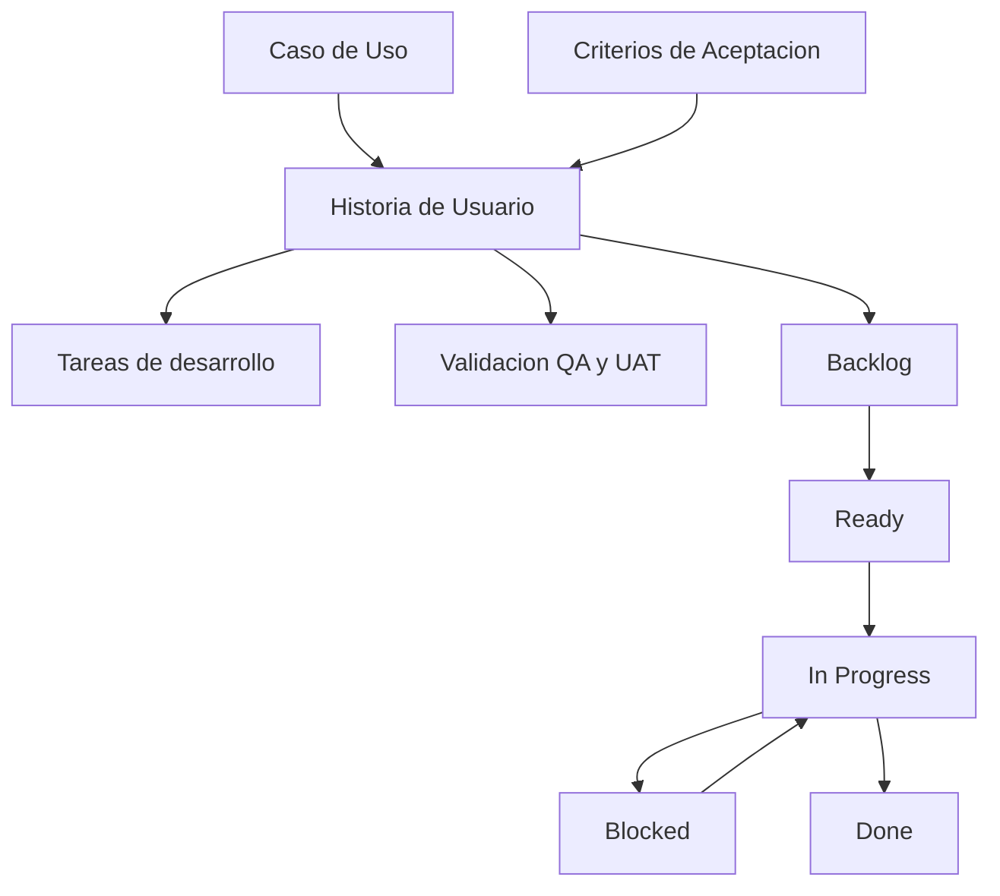

# 🧩 Guía: ¿Cómo crear una Historia de Usuario?

Una **Historia de Usuario (HU)** describe una necesidad funcional desde la perspectiva de quien recibe valor. Debe ser breve, verificable y suficientemente clara para que Producto, Desarrollo y QA compartan el mismo entendimiento antes de iniciar la implementación.

En l4 repo docs, una HU debe nacer preferiblemente de un **Caso de Uso (CU)** o de una regla de negocio validada. El CU explica el flujo completo; la HU convierte una parte implementable de ese flujo en trabajo listo para desarrollo.

---

## 🔗 Relación entre Caso de Uso, HU, Tareas y Validación



*   **Caso de Uso:** Define el contexto de negocio, actores, precondiciones, flujo principal, flujos alternos, postcondiciones y reglas de negocio.
*   **Historia de Usuario:** Define una necesidad concreta que puede ser implementada y validada.
*   **Criterios de Aceptación:** Definen las condiciones verificables para aceptar la HU.
*   **Tareas:** Dividen la implementación en actividades técnicas manejables.
*   **Validación QA y UAT:** Confirma que la HU cumple los criterios de aceptación y la necesidad de negocio.

Los casos de prueba se documentan en la guía técnica **[Casos de Prueba](../docs/casos-prueba.html)**. El avance operativo de la HU se rige por el **[GitHub Flow l4 repo docs](../procesos/github-flow.md)**.

---

## 📝 Estructura mínima de una HU

Toda Historia de Usuario debe contener:

| Campo | Descripción |
| :--- | :--- |
| **ID** | Identificador único. Ejemplo: `HU-001`. |
| **Nombre** | Título corto y claro de la necesidad. |
| **Caso de Uso relacionado** | Referencia al CU del que nace la historia. Ejemplo: `CU-003 - Registro de comercio`. |
| **Product Owner** | Responsable de validar el valor de negocio y aceptar la entrega. |
| **Estado** | `Backlog`, `Ready`, `In Progress`, `Blocked` o `Done`. |
| **Historia** | Redacción en formato `Como / Quiero / Para`. |
| **Criterios de Aceptación** | Condiciones verificables para aceptar la historia. |
| **Descripción** | Contexto adicional necesario para implementar sin ambigüedad. |
| **Tareas** | Trabajo técnico requerido para completar la HU. |
| **Validación esperada** | Indica si requiere QA, UAT o ambas. El detalle de casos de prueba vive en `/docs/casos-prueba.html`. |

---

## ✍️ Formato recomendado

Usa este formato para redactar la necesidad principal:

```text
Como: [Rol/Actor]
Quiero: [Acción o funcionalidad]
Para: [Beneficio o valor esperado]
```

Ejemplo:

```text
Como: Comercio Solicitante
Quiero: registrar mis datos básicos en la plataforma
Para: iniciar el proceso de aprobación de mi cuenta
```

La historia debe enfocarse en el **qué** necesita el usuario y el **para qué** genera valor. Evita incluir detalles técnicos de implementación en esta frase.

---

## 📋 Criterios de Aceptación

Cada HU debe tener criterios de aceptación suficientes para que Desarrollo y QA puedan validar si está terminada. Pueden escribirse en dos formatos:

### Escenario Gherkin / BDD

```text
Escenario: Registro exitoso de datos básicos
Dado que el comercio solicitante está en el formulario de registro
Cuando completa todos los campos obligatorios con datos válidos
Entonces el sistema debe guardar la información
Y debe permitir avanzar al siguiente paso del registro
```

### Checklist declarativo

```text
[ ] El formulario debe marcar como obligatorios los campos Nombre, Identificación, Correo y Teléfono.
[ ] El botón "Continuar" debe permanecer deshabilitado hasta que los campos obligatorios sean válidos.
[ ] El sistema debe mostrar un mensaje claro cuando el correo ya exista.
```

Los criterios deben ser:

*   **Verificables:** Se puede confirmar objetivamente si se cumplen.
*   **Enfocados en el qué:** Describen comportamiento esperado, no la solución técnica.
*   **Delimitados:** Aclaran qué entra y qué queda fuera del alcance.

Consulta la **[Guía de Criterios de Aceptación](criterios-aceptacion.md)** para más ejemplos.

---

## 🧾 Descripción de la HU

La descripción complementa la frase `Como / Quiero / Para`. Debe incluir solo el contexto necesario para cumplir los criterios de aceptación:

*   Origen de la necesidad o regla de negocio relacionada.
*   Supuestos relevantes.
*   Restricciones funcionales.
*   Dependencias con otros flujos, sistemas o equipos.
*   Consideraciones de UX, datos o permisos cuando sean necesarias.

Evita usar la descripción como sustituto de los criterios de aceptación. Si una condición define cuándo la HU está completa, debe estar en los criterios.

---

## 📌 Estados de la HU

| Estado | Uso |
| :--- | :--- |
| **Backlog** | La necesidad está identificada, pero aún requiere definición, priorización o refinamiento. |
| **Ready** | La HU tiene alcance, criterios de aceptación y contexto suficiente para iniciar desarrollo. |
| **In Progress** | La HU está siendo implementada en una rama de trabajo. |
| **Blocked** | Hay un impedimento que debe resolverse antes de continuar. |
| **Done** | La HU fue integrada a `main`, pasó revisión/CI, completó QA/UAT cuando aplique y cumple sus criterios de aceptación. |

Para el detalle de ramas, PRs, CI, aprobaciones y entrega, consulta el **[GitHub Flow l4 repo docs](../procesos/github-flow.md)**.

---

## ✅ Tareas de desarrollo

Las tareas descomponen la HU en trabajo técnico ejecutable. Cada tarea debe tener título y, cuando haga falta, una descripción breve.

Ejemplo:

```text
Backlog
- Refinar criterios de aceptación pendientes.

Ready
- Crear estructura del formulario de registro.
- Agregar validaciones de campos obligatorios.

In Progress
- Integrar endpoint de guardado de datos básicos.

Blocked
- Pendiente definición de mensaje legal requerido.

Done
- Agregar pruebas unitarias de validación.
```

Buenas prácticas:

*   Mantén las tareas pequeñas y trazables.
*   No uses tareas para redefinir alcance de negocio.
*   Si una tarea descubre una regla nueva, actualiza la HU o el Caso de Uso relacionado.
*   Respeta los límites de trabajo en progreso definidos por el equipo.

---

## 🧪 Validación esperada

La HU debe indicar qué validaciones aplican, sin documentar ahí el detalle completo de cada caso de prueba.

Ejemplo:

```text
Validación esperada:
- QA: Requerido
- UAT / PO: Requerido
- Casos de prueba: Ver docs/casos-prueba.html
```

Los casos de prueba deben documentarse o referenciarse según el estándar definido en **[Casos de Prueba](../docs/casos-prueba.html)**.

---

## 📌 Plantilla rápida

```markdown
# HU-XXX - [Nombre de la historia]

**Caso de Uso relacionado:** [CU-XXX - Nombre del caso de uso]  
**Product Owner:** [Nombre]  
**Estado:** [Backlog / Ready / In Progress / Blocked / Done]  

## Historia

**Como:** [Rol/Actor]  
**Quiero:** [Acción o funcionalidad]  
**Para:** [Beneficio o valor esperado]

## Criterios de Aceptación

### Escenario 1: [Nombre del escenario]
*   **Dado** [contexto]
*   **Cuando** [acción]
*   **Entonces** [resultado esperado]

### Checklist
*   [ ] [Criterio verificable]
*   [ ] [Criterio verificable]

## Descripción

[Contexto adicional necesario para implementar y validar la historia.]

## Tareas

### Backlog
*   [ ] [Pendiente de refinamiento o definición]

### Ready
*   [ ] [Tarea técnica]

### In Progress
*   [ ] [Tarea técnica]

### Blocked
*   [ ] [Impedimento actual]

### Done
*   [x] [Tarea completada]

## Validación esperada

*   **QA:** [N/A / Requerido]
*   **UAT / PO:** [N/A / Requerido]
*   **Casos de prueba:** [Referencia a docs/casos-prueba.html, issue, PR o herramienta de gestión]
```
